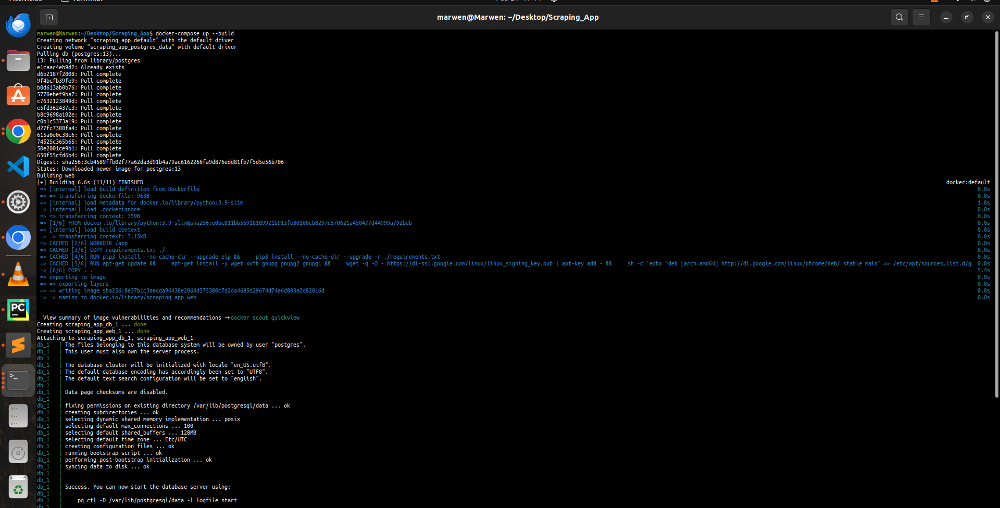
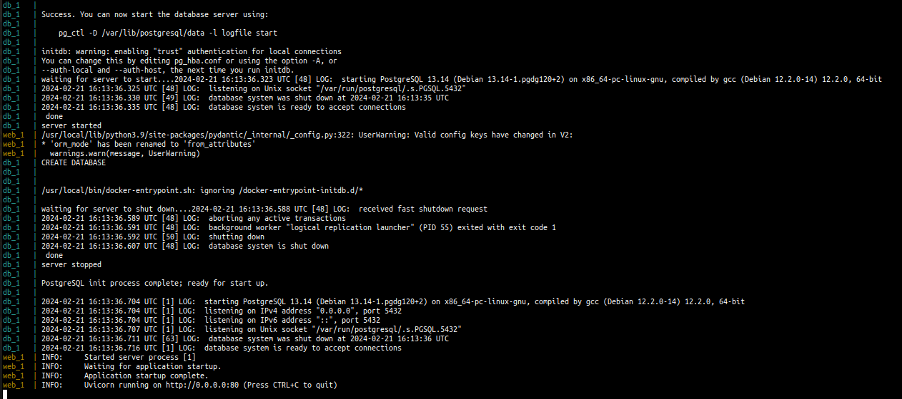
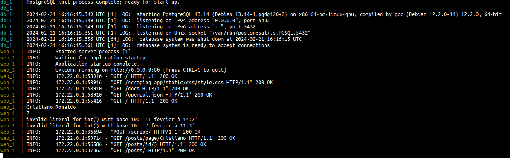
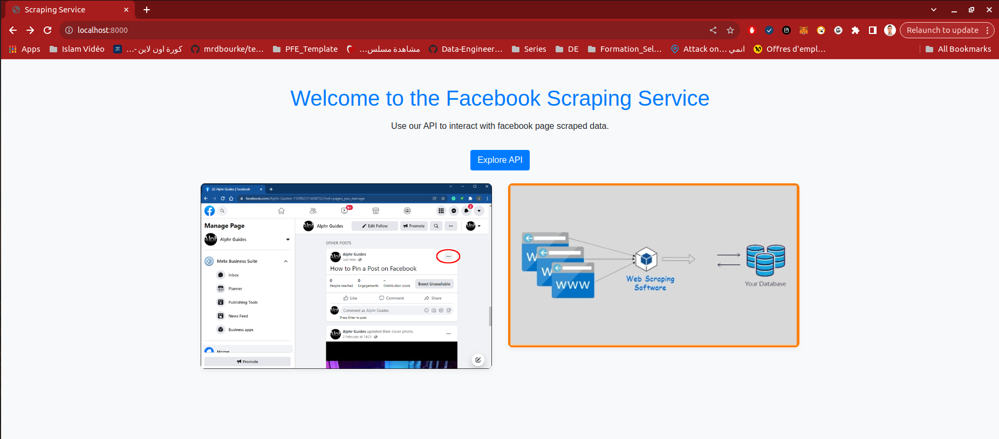
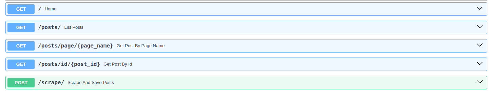
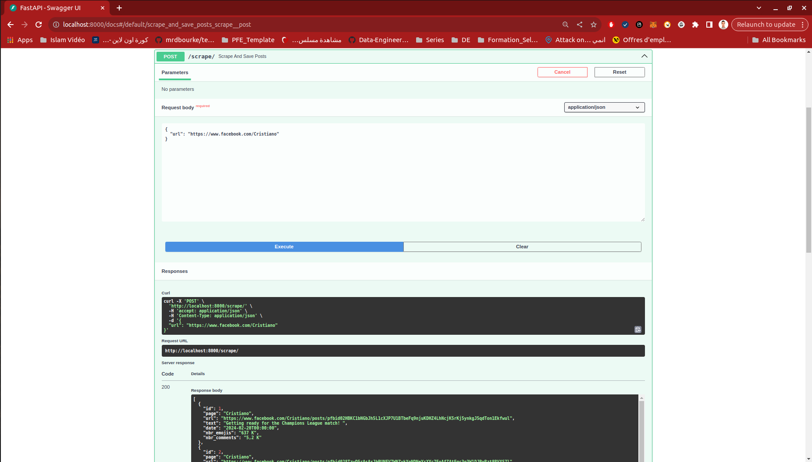
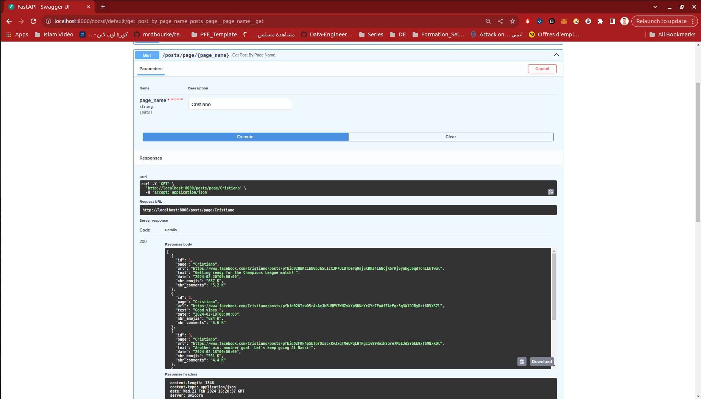
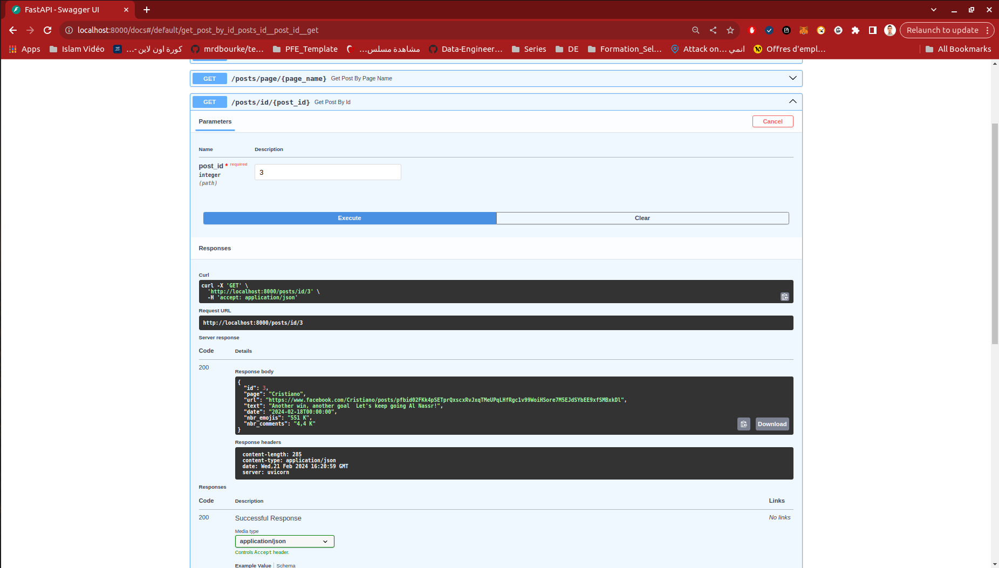
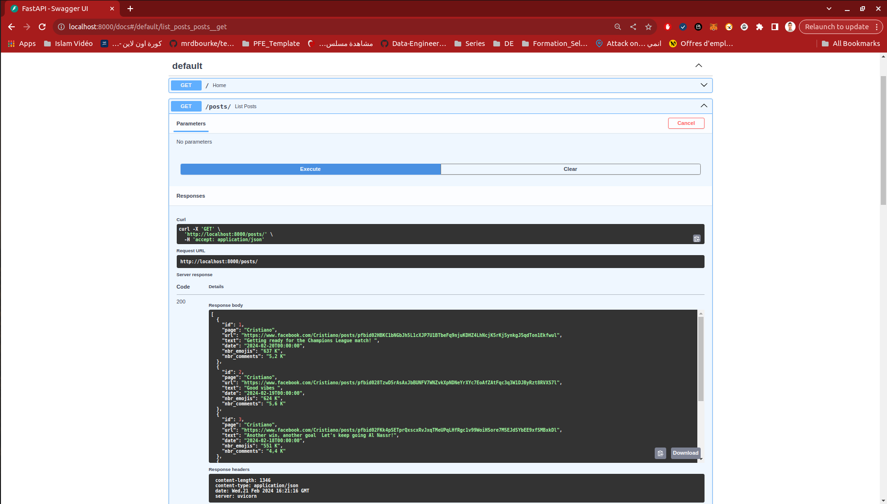
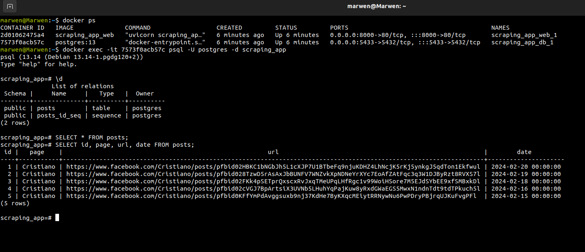

# FastAPI - Facebook Scraping App

This project demonstrates a FastAPI application designed to scrape data from public Facebook pages, save the scraped data into a PostgreSQL database, and dockerize the entire application for easy deployment and scalability.

## Getting Started

These instructions will help you set up and run the project on your local machine for development and testing purposes.

### Prerequisites

- Docker
- Docker Compose
- Python 3.9 or higher

### Installation

1. Clone the repository to your local machine:
   ```sh
   git clone https://github.com/marwenmejri/FastAPI-Facebook-Scraping-App.git

2. Navigate to the project directory:
    ```sh
   cd yourrepositoryname

3. Create a .env file in the root of the project directory and fill in your PostgreSQL database credentials and other environment variables as described in this .env.example:
    ```sh 
    DB_USER=postgres
    DB_PASSWORD=20759232
    DB_NAME=scraping_app
    DB_HOST=localhost
    DB_PORT=5432

4. Build and start the containers:
    ```sh 
   docker-compose up --build







### Using the Application
- Once the application is running, you can access it at http://localhost:8000.





### Endpoints
- GET /: The home page with a welcome message.

- Scrape And Save Posts


- Get Post By Page Name


- Get Post By Id


- List Posts


### Postgres DB




## Authors
Marwen Mejri - Data Engineer - https://github.com/marwenmejri